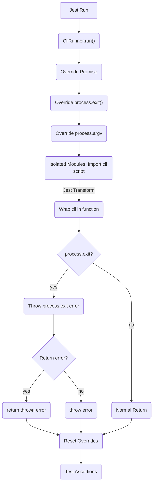
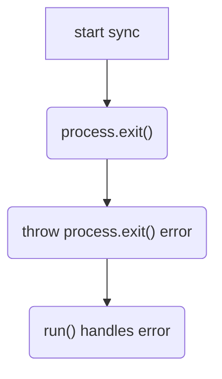
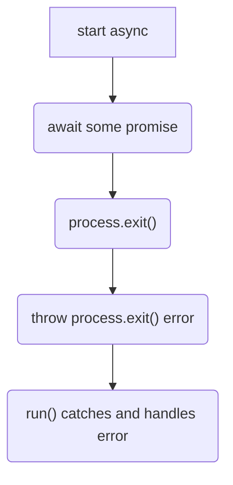
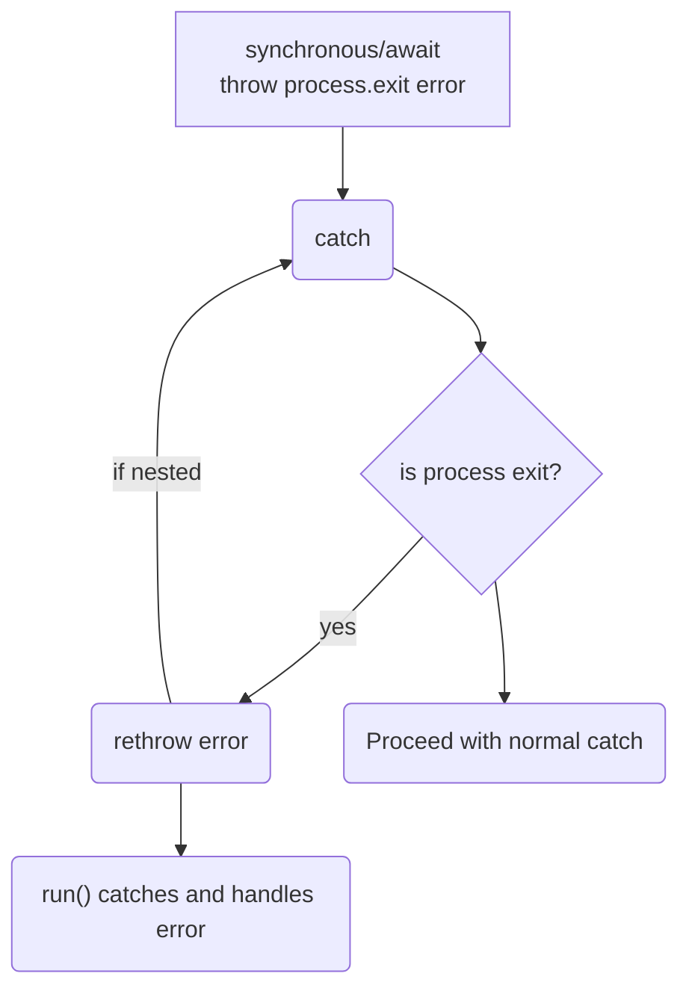
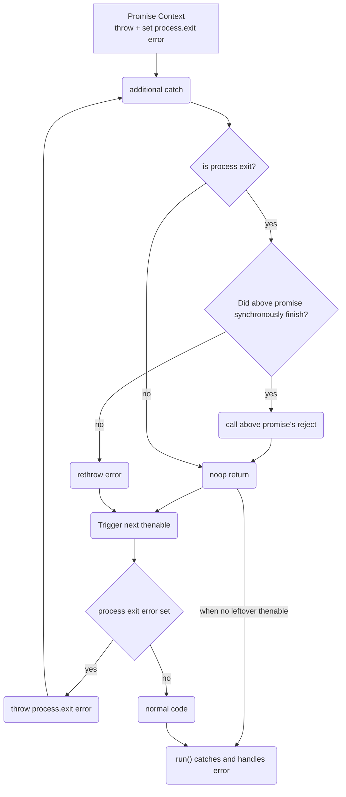

# Design

## General Flow

### About

In general, when using `jest-cli-tester`:

* jest will start running its tests
* When a CliRunner.run() is called, the test will override
    * process.exit with a function that throws an error
    * process.argv with arguments like a cli call
    * Promises with a constructor that can propagate the process.exit error to simulate a process.exit
* The test cli script that is run is then run in an isolated context
  * This means the cli script is guaranteed to reload despite any number of tests of the same screipt
  * On each reload, the Cli transformer will run and wrap the script into a module so that run can await it and catch any process.exit errors
* The process will either throw a process.exit error or return as expected
* If an error is thrown, depending on the CLIRunner setting, the `run()` method will either throw the same error or will return it as a string
* Before returning, the CLIRunner will reset its overrides

## Propagating process.exit()

In a synchronous or awaited context, we can see that jest CLI Tester needs to have a hook at the beginning of every catch (and finally) to rethrow any 
process.exit error that may have been caught while also avoiding any additional code running (since we are simulating a process exit).
Ultimately, the error will trickle up to the `run()` function where CLIRunner can handle it and return accordingly.

In a Promise context, we run into a little different problem.  This problem is that we can end up with asynchronous code that
is not awaited that is meant to call the reject() or resolve() functions of another promise.  In these cases, if we just threw
an error, we would get an uncaught exception or a hanging process because our error bypassesed a fulfillment call to the upper level
promise.

This is why we override the `Promise object`.  In part, this is done to:

1. Wrap every promise/then/catch/finally handler with a short circuit that throws the process exit error if it is globally set
2. Track if the above promise exits (via AysncLocalStorage), and whether or not it is done running synchronously
   1. This allows us to know if throwing will still be caught (note: there can be an exotic use case here, but we will need a reasonable example of its actual use case)
3. Add a catch to the end of each of those promises (that does not throw) but instead:
   1. Evaluates if the parent promise is done calling its handler, and throws if it isn't (that way we bypass any additional logic)
   2. If the promise above is already done with its handler code, we then just call the `reject()` of the parent promise and then return

The flow chart below shows the flow from throwing within a promise.  This coupled with our injection into synchronous try catch language
constructs, means that we should be propagating a process.exit as the first action all the way up to the `run()` context, thus simulating
process.exit() without corrupting the process.

TODO: finish editing this
