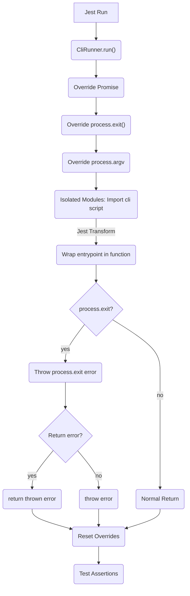
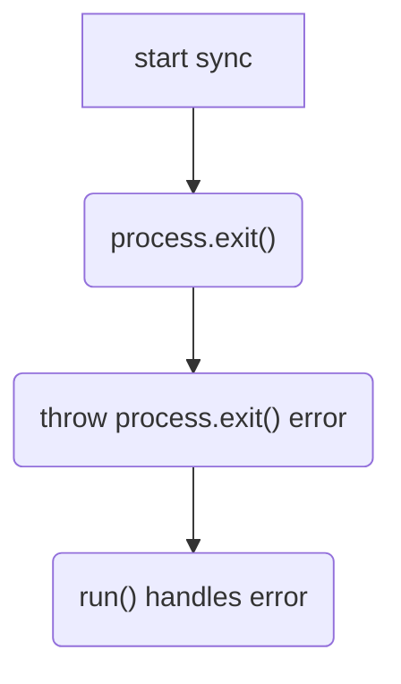
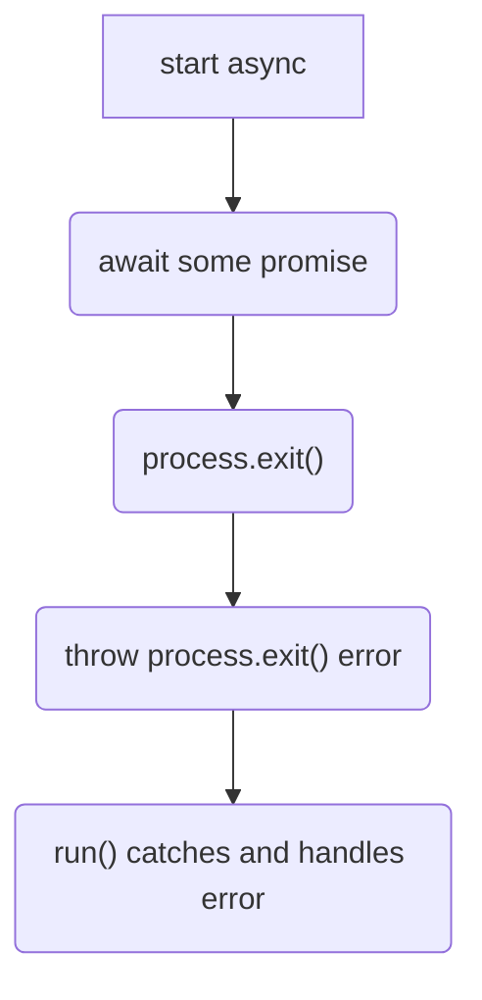
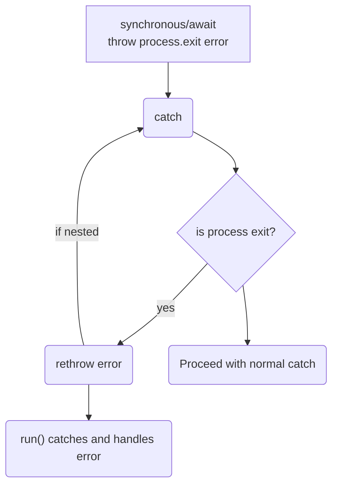
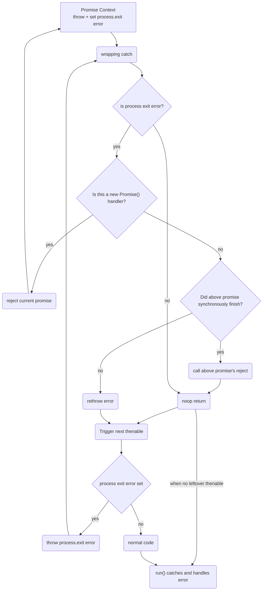

# Design

## General Flow



### About

In general, when using `jest-cli-tester`:

* jest will start running its tests
* When a CliRunner.run() is called, the test will override
    * process.exit with a function that throws an error
    * process.argv with arguments like a cli call
    * Promises with a constructor that can propagate the process.exit error to simulate a process.exit
* The test cli script that is run is then run in an isolated context
  * This means the cli script is guaranteed to reload despite any number of tests of the same script
  * On each reload, the Cli transformer will run and wrap the script into a module so that run can await it and catch any process.exit errors
    * NOTE: we only transform the entrypoint with catch injection at this point - further design would be needed to transform other files.
* The process will either throw a process.exit error or return as expected
* If an error is thrown, depending on the CLIRunner setting, the `run()` method will either throw the same error or will return it as a string
* Before returning, the CLIRunner will reset its global overrides

## Propagating process.exit()

Since process.exit is supposed to stop code execution at the moment of
its call, we need to effectively simulate the same behavior without 
endangering the integrity of the application stack (in order to allow
additional tests and assertions).

Because of this, we need to effectively throw a very specific error
when process.exit() is called and then insert handlers within different
contexts to ensure that process.exit() bubbles up to our `run()` call
before any other code execution.

(Please note, the design is supplied here in an effort to have others
point out if there are contexts that may not work as intended.)

### Simple Synchronous context


In the simplest case, process.exit() throws an error within a synchronous call and the error is caught by the `CliRunner.run()` method.

### Simple Awaited context



Just like with the fully synchronous case, if we are using awaited functions, then the behavior is the same as a synchronous context

### Synchronous/Awaited Caught context



In a synchronous or awaited context, we can see that jest CLI Tester needs to have a hook at the beginning of every catch (and finally) to rethrow any 
process.exit error that may have been caught while also avoiding any additional code running (since we are simulating a process exit).
Ultimately, the error will trickle up to the `run()` function where CLIRunner can handle it and return accordingly.

### Detached Async Contexts (i.e. Promises)

In a Promise context, we run into a little different problem.  This problem is that we can end up with asynchronous code that
is not awaited and is meant to call the reject() or resolve() functions of another promise at a later context.  In these cases, if we just threw
an error, we would get an uncaught exception or a hanging process because our error bypassed a fulfillment call to the upper level
promise.

Example:

```typescript
// Note - this is contrived and is a bad design
await new Promise((res) => {
    someAsyncMethod.then(() => {
        if (something) {
            process.exit();
            // If you throw an error here
            // the upper promise never resolves :(
        }
        res();
    })
})
```

For this reason, we override the `Promise object`.  In part, this is done to:

1. Wrap all but the (await and async generator) promise/then/catch handlers with a short circuit 
   that throws the process exit error if it is globally set
2. Additionally, wraps all of the previous handlers in try-catches that:
   1. Evaluates if the parent promise is done calling its handler, and throws if it isn't (because we're in a sync/awaited context)
   2. If the promise above is already done with its handler code, we then just call the `reject()` of the parent promise or just return if
   the promise already had its `reject()` called

Important notes about implementation:

* Since this is working within the NodeJS native code wrapping system, we actually have to be careful to do these throws and catches
  without sabotaging any wrapping native code for promises.  This is based off of testing and may be refined further if someone has more 
  knowledge.
* The implementation is meant to cover best practice patterns for promise usage. In its most general form, throwing from within an awaited
  Promise should work.  If you are doing deeply nested promises where a process exit call is called within some promise that is supposed to 
  resolve a promise many layers up, you may experience hanging tests and we recommend a refactor or at least mocking that section.

The flow chart below shows the flow from throwing within a promise.  This coupled with our injection into synchronous try catch language
constructs, means that we should be propagating a process.exit as the first action all the way up to the `run()` context, thus simulating
process.exit() without corrupting the process.



### Known edge cases

The entirety of the process.exit() calls within a Promise is, to put it lightly, a slog.
The current tests within [asyncCliScript.ts](./src/tests/scripts/asyncCLIScript.ts), show guaranteed patterns for process.exit to work.  However, if you are doing exotic interdependent promise rejection, you may run into issues because process.exit() is not able
to reject all promises via errors:

```typescript
// Combining a promise with an async function and awaiter has 
// not proven reliable to propagate through
await new Promise(async (outerRes) => {
    await new Promise((res) => {
        if (someCondition) {
            process.exit(); // Pretend you somehow got here
        }
        res();
        outerRes();
    });
});
```

If you would like to use this library with something like this,
you would need (and we would recommend) to do your own rejection up 
to a simpler level where process.exit() does not have to reject all
these loosely coupled promises.

```typescript
try {
await new Promise(async (outerRes, outerRej) => {
    try {
        await new Promise((res, rej) => {
            if (someCondition) {
                rej('oh no');
            }
            res();
            outerRes();
        });
    } catch (e) {
        outerRej(e);
    }
});
} catch (e) {
    if (e === 'oh no') {
        process.exit(22);
    }
}

```